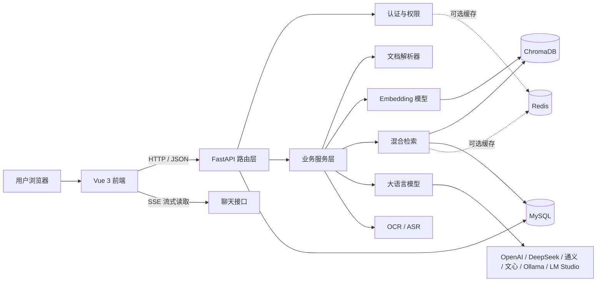
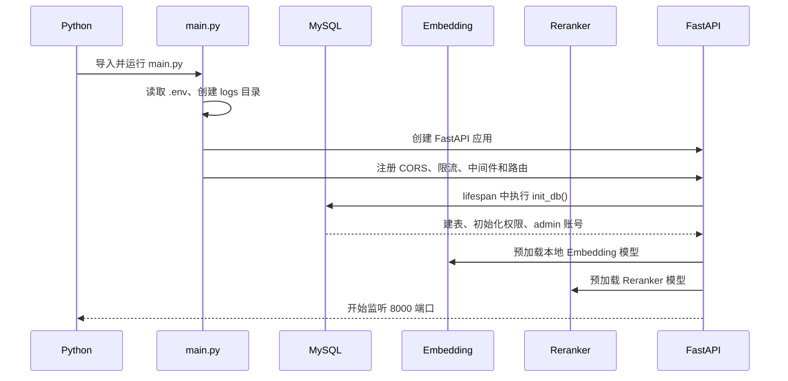
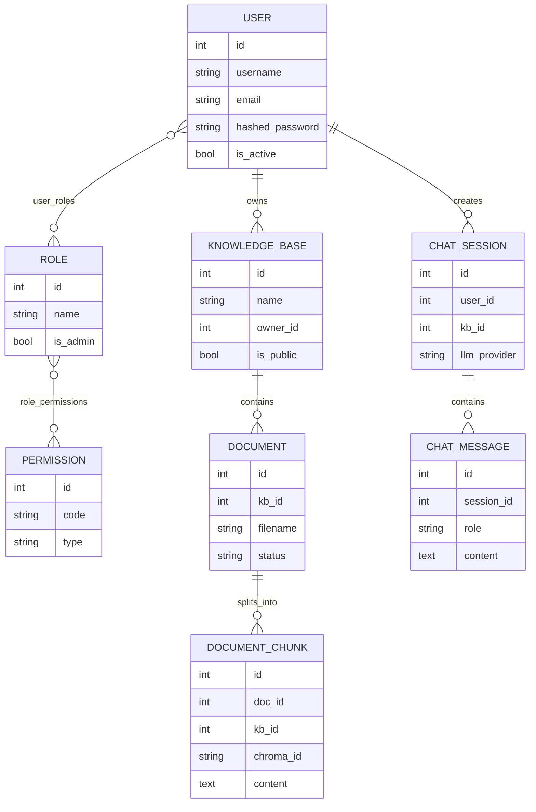
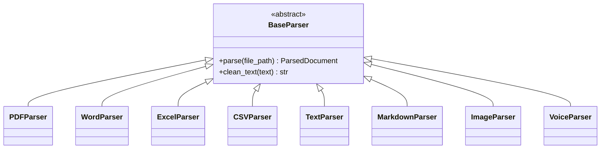
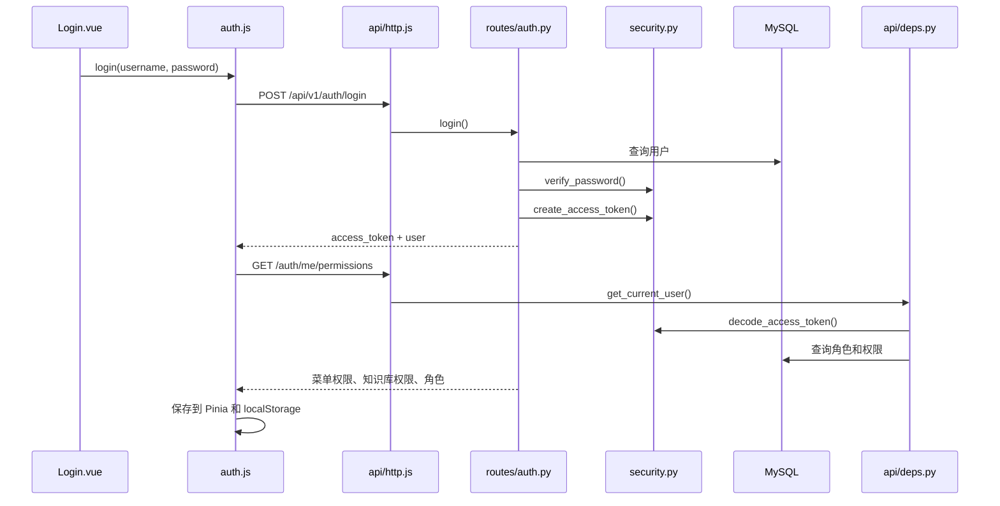
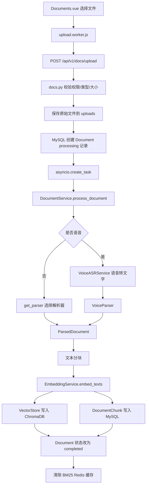
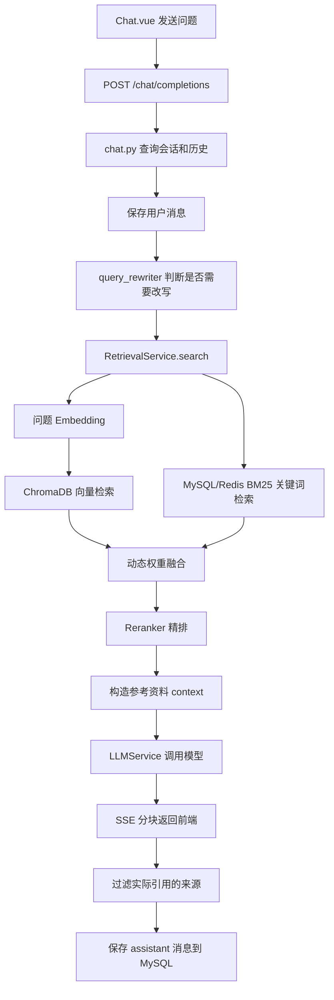
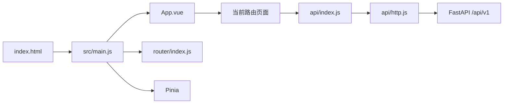
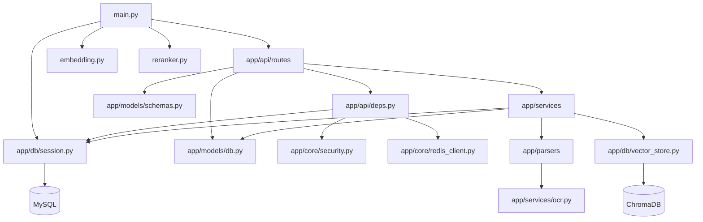

# RAG 知识库项目零基础学习指南

> 适用对象：第一次接触 Python、FastAPI、Vue、数据库和 RAG 的学习者。  
> 文档目标：帮助你先建立全局地图，再逐步阅读代码，而不是一开始陷入模型、数据库和异步代码的细节。

---

## 1. 先用一句话理解这个项目

这是一个“把自己的文档交给 AI，再根据文档回答问题”的系统。

用户可以：

1. 注册和登录系统。
2. 创建知识库。
3. 上传 PDF、Word、Excel、文本、Markdown、图片或语音文件。
4. 系统把文件解析成文字，再切成许多小段。
5. 系统把每个文本小段转换成向量，保存到 ChromaDB，同时把业务信息保存到 MySQL。
6. 用户提问时，系统从知识库中找出相关文本。
7. 系统把“用户问题 + 找到的文本”一起交给大语言模型。
8. 大语言模型生成带来源引用的答案。

这就是 RAG：Retrieval-Augmented Generation，中文通常叫“检索增强生成”。

---

## 2. 你现在不需要立刻掌握的所有名词

第一次阅读时，只需要先记住下面的简单解释。

| 名词 | 零基础解释 | 本项目中的位置 |
|---|---|---|
| 前端 | 用户看见并点击的网页 | `frontend/` |
| 后端 | 接收网页请求、处理业务的程序 | `main.py`、`app/` |
| API | 前端调用后端的约定地址 | `app/api/routes/` |
| MySQL | 保存用户、知识库、文档、聊天记录等结构化数据 | `app/models/db.py` |
| ORM | 用 Python 类操作数据库表 | SQLAlchemy |
| Schema | 规定 API 接收和返回的数据形状 | `app/models/schemas.py` |
| ChromaDB | 保存文本向量、执行语义搜索 | `app/db/vector_store.py` |
| Embedding | 把文字转换成一组数字，方便比较语义 | `app/services/embedding.py` |
| BM25 | 根据关键词匹配文本 | `app/services/retrieval.py` |
| Reranker | 对初步检索结果再次精细排序 | `app/services/reranker.py` |
| LLM | OpenAI、DeepSeek、Ollama 等大语言模型 | `app/services/llm.py` |
| OCR | 从图片中识别文字 | `app/services/ocr.py` |
| ASR | 从语音中识别文字 | `app/services/voice_asr.py` |
| JWT | 登录成功后证明用户身份的 Token | `app/core/security.py` |
| Redis | 可选缓存，用来减少重复计算和数据库查询 | `app/core/redis_client.py` |
| async/await | Python 异步编程语法，等待数据库或网络时允许处理其他请求 | API 与数据库代码中大量使用 |
| SSE | 后端把模型生成的文字一小段一小段推给前端 | 聊天流式响应 |

---

## 3. 项目的整体架构



### 3.1 分层思想

这个项目大体分为以下层次：

```text
前端页面
  ↓
前端 API 封装
  ↓
FastAPI 路由层 app/api/routes
  ↓
服务层 app/services
  ↓
数据库层 app/db + 数据模型 app/models
  ↓
MySQL / ChromaDB / Redis / 外部模型 API
```

理解分层非常重要：

- 路由层负责“接收请求、校验权限、返回结果”。
- 服务层负责“真正的业务处理”。
- 数据模型负责“数据长什么样、怎么保存”。
- 前端负责“把数据展示给用户，并响应用户操作”。

---

## 4. 项目目录总览

```text
rag-knowledge-base/
├── main.py                         后端启动入口
├── requirements.txt                Python 依赖
├── .env.example                    环境变量示例
├── alembic.ini                     Alembic 数据库迁移配置，目前未完整启用
├── README.md                       项目简介
├── 环境搭建.txt                    Windows 环境安装说明
├── app/
│   ├── api/
│   │   ├── deps.py                 登录验证与权限依赖
│   │   └── routes/                 所有 HTTP API
│   ├── core/                       配置、安全、日志、Redis
│   ├── db/                         MySQL 会话和 ChromaDB
│   ├── models/                     数据库模型与 API 数据模型
│   ├── parsers/                    各种文件解析器
│   └── services/                   文档、检索、模型、OCR、语音等业务逻辑
├── frontend/
│   ├── package.json                前端依赖和命令
│   ├── vite.config.js              Vite 开发配置和 API 代理
│   └── src/
│       ├── api/                    前端请求后端的统一封装
│       ├── router/                 页面路由和前端权限守卫
│       ├── stores/                 登录状态管理
│       ├── views/                  页面组件
│       └── workers/                文件上传 Web Worker
└── tests/evaluation/retrievalCode/ RAG 检索评估与消融实验脚本
```

### 4.1 `__init__.py` 是什么

项目中多个目录都有空的 `__init__.py`：

- `app/__init__.py`
- `app/api/__init__.py`
- `app/api/routes/__init__.py`
- `app/core/__init__.py`
- `app/db/__init__.py`
- `app/models/__init__.py`
- `app/services/__init__.py`

它们的主要作用是告诉 Python：“这个目录是一个可以导入的包”。例如：

```python
from app.core.config import settings
```

这里的 `app.core.config` 就对应 `app/core/config.py`。

### 4.2 根目录配置和说明文件

| 文件 | 功能 | 学习时是否需要细读 |
|---|---|---|
| `main.py` | FastAPI 后端入口和应用装配中心 | 必须 |
| `requirements.txt` | Python 第三方依赖清单 | 先认识分类，不必研究每个包 |
| `.env.example` | 环境变量模板 | 必须 |
| `.gitignore` | 告诉 Git 哪些本地文件不要提交，例如 `.env`、模型数据和 `node_modules` | 建议了解 |
| `alembic.ini` | Alembic 数据库迁移配置；当前缺少对应 `migrations/` | 后期阅读 |
| `README.md` | 项目功能、启动方式和技术栈简介 | 第一个阅读 |
| `环境搭建.txt` | Windows 安装 Python、Node、MySQL 等环境的说明 | 搭环境时阅读，其中部分内容已经过期 |
| `.vscode/settings.json` | VS Code 默认使用 Conda 环境管理器 | 使用 VS Code 时了解 |

---

## 5. 后端启动过程

入口文件是 [`main.py`](./main.py)。

启动命令：

```powershell
python main.py
```

启动时的主要过程：



`main.py` 的主要职责：

- 加载 `.env`。
- 设置 Hugging Face 缓存目录。
- 创建 FastAPI 应用。
- 启动时初始化数据库。
- 预加载 Embedding 和 Reranker。
- 配置 CORS。
- 配置 slowapi 请求限流。
- 记录每个请求的路径、状态码和耗时。
- 注册所有 API 路由。
- 提供 `/` 和 `/health`。
- 尝试挂载生产环境前端静态文件。

---

## 6. 数据库模型和关系

数据库模型定义在 [`app/models/db.py`](./app/models/db.py)。每个继承 `Base` 的类通常对应一张 MySQL 表。



### 6.1 主要关系

- 用户与角色是多对多关系，中间表是 `user_roles`。
- 角色与权限是多对多关系，中间表是 `role_permissions`。
- 一个用户可以创建多个知识库。
- 一个知识库包含多个文档。
- 一个文档会被切成多个 `DocumentChunk`。
- 一个用户可以创建多个聊天会话。
- 一个聊天会话包含多条消息。
- `ModelConfig` 独立保存大模型 Provider 配置。
- `VoiceConfig` 独立保存百度或阿里云语音配置。

### 6.2 知识库权限的特殊实现

菜单权限使用固定编码，例如：

```text
chat
kb_manage
stats
model_config
```

具体知识库权限则动态表示为：

```text
kb:1
kb:2
kb:3
```

也就是说，角色如果拥有 `kb:2` 权限，就可以访问 ID 为 2 的知识库。这个关系没有单独的“角色知识库关联表”，而是复用了 `permissions` 和 `role_permissions`。

---

## 7. 类的继承关系

### 7.1 文档解析器继承



`BaseParser` 是抽象基类。它规定所有解析器都必须实现 `parse()`，这样文档服务不需要关心文件具体是什么格式。

### 7.2 其他重要继承

- `Settings(BaseSettings)`：让配置类能够自动读取环境变量和 `.env`。
- 所有 ORM 模型继承 SQLAlchemy 的 `Base`。
- 所有 API Schema 继承 Pydantic 的 `BaseModel`。
- `RoleWithKbIds(RoleOut)`：在角色基础返回数据上增加知识库 ID 列表。
- 自定义 `HTTPBearer(HTTPBase)`：修改 FastAPI 默认 Token 缺失时的错误提示。
- `DocumentStatus(str, enum.Enum)`：既可以像字符串一样使用，也具有枚举约束。
- `VoiceProvider(str, enum.Enum)`：限制语音 Provider 类型。

`DocumentService`、`EmbeddingService`、`RetrievalService` 等服务类之间没有继承关系，它们主要通过静态方法或类方法互相调用。

---

## 8. 三条最重要的业务调用链

## 8.1 登录和权限调用链



之后所有普通 Axios 请求都会在 `api/http.js` 的请求拦截器中加入：

```http
Authorization: Bearer 用户Token
```

后端路由通过：

```python
current_user: User = Depends(require_permission("chat"))
```

完成登录验证和权限验证。

## 8.2 文档上传和入库调用链



这里需要特别理解“两份存储”：

- MySQL 保存文档业务信息和完整文本块，用于管理、BM25 和页面展示。
- ChromaDB 保存文本、元数据和向量，用于语义检索。
- `DocumentChunk.chroma_id` 把 MySQL 文本块和 ChromaDB 向量记录关联起来。

## 8.3 聊天 RAG 调用链



检索不是只使用一种方法：

1. 向量检索擅长找语义相似内容。
2. BM25 擅长找明确关键词、数字和条款。
3. 动态权重根据问题内容调节两者比例。
4. Reranker 再逐条判断“问题与候选文本是否真的相关”。

---

## 9. 后端各子目录和文件说明

## 9.1 `app/core/`：公共基础设施

| 文件 | 功能 | 被谁调用 |
|---|---|---|
| `config.py` | 定义 `Settings`，读取 `.env`，生成 MySQL URL，保存模型、检索、上传等配置 | 几乎所有模块 |
| `security.py` | bcrypt 密码哈希、密码验证、JWT 创建和解析 | `auth.py`、`deps.py`、数据库初始化 |
| `logger.py` | 配置 Loguru，日志同时输出到控制台和 `logs/` | 所有需要记录日志的模块 |
| `redis_client.py` | Redis 连接池和字符串/JSON 缓存封装 | 权限缓存、BM25 缓存、模型配置缓存 |
| `__init__.py` | 标记 Python 包 | Python 导入系统 |

### `config.py` 应重点理解

```python
settings = Settings()
```

其他文件导入的是同一个 `settings` 对象：

```python
from app.core.config import settings
```

因此 `.env` 中的值会影响整个系统。

## 9.2 `app/models/`：数据结构

| 文件 | 功能 |
|---|---|
| `db.py` | SQLAlchemy ORM 模型，对应 MySQL 表和表关系 |
| `schemas.py` | Pydantic 请求/响应模型，负责 API 数据校验与序列化 |
| `__init__.py` | 包标记 |

不要混淆两类模型：

- `db.py` 的 `User` 是数据库对象。
- `schemas.py` 的 `UserOut` 是发给前端的数据对象。

典型转换：

```python
UserOut.model_validate(user)
```

## 9.3 `app/db/`：数据库访问

| 文件 | 功能 |
|---|---|
| `session.py` | 创建 MySQL 异步/同步引擎、提供数据库 Session、建表、初始化管理员和权限 |
| `vector_store.py` | 封装 ChromaDB；每个知识库对应一个 `kb_{id}` Collection |
| `__init__.py` | 包标记 |

`session.py` 同时存在两套引擎：

- `async_engine`：FastAPI 请求日常使用，配合 `await`。
- `sync_engine`：文档线程池和 Alembic 使用。

`get_db()` 是 FastAPI 依赖：成功后提交事务，发生异常则回滚。

## 9.4 `app/parsers/`：文件解析器

| 文件 | 功能 |
|---|---|
| `base.py` | 定义 `ContentBlock`、`ParsedPage`、`ParsedDocument` 和抽象 `BaseParser` |
| `__init__.py` | `get_parser()` 工厂，根据扩展名选择解析器 |
| `pdf.py` | 用 PyMuPDF 读取文本、表格和 PDF 内嵌图片 OCR |
| `word.py` | 用 python-docx 按原顺序解析段落和表格 |
| `excel.py` | 用 pandas 解析 Excel 和 CSV，转换成文本表格 |
| `text.py` | 尝试 UTF-8、GBK、UTF-16 读取纯文本 |
| `markdown.py` | 保留 Markdown 标题、列表和代码块结构 |
| `image.py` | 调用 `OCRService` 从图片识别文字 |
| `voice.py` | 包装已经由 ASR 得到的文字，本身不调用语音平台 |
| `ocr_utils.py` | 为 PDF 解析器提供 OCR 函数别名 |

统一解析结果：

```text
ParsedDocument
  └── pages: ParsedPage[]
        ├── page_num
        ├── content
        └── blocks: ContentBlock[]
              ├── text
              ├── table
              └── image_text
```

这种统一接口使后续分块代码不需要针对每一种文件重新写一整套流程。

## 9.5 `app/services/`：核心业务逻辑

| 文件 | 功能 | 关键调用 |
|---|---|---|
| `document.py` | 文档后台处理总控制器：解析、分块、向量化、MySQL/ChromaDB 入库、语音分支 | parsers、EmbeddingService、VectorStore |
| `embedding.py` | 本地 SentenceTransformer 或 OpenAI Embedding；自动检测 CPU/GPU、批量编码和模型缓存 | 文档入库、查询检索、评估脚本 |
| `retrieval.py` | 向量检索 + BM25 + 动态权重 + Reranker + 降级策略 | VectorStore、MySQL、Redis、Reranker |
| `reranker.py` | 使用 FlagEmbedding Cross-Encoder 对候选文本精排 | RetrievalService、评估脚本 |
| `query_rewriter.py` | 判断追问是否依赖历史上下文，必要时调用 LLM 改写为独立问题 | chat.py |
| `llm.py` | 统一封装 OpenAI、DeepSeek、通义、文心、Ollama、LM Studio | chat.py、query_rewriter.py、评估脚本 |
| `ocr.py` | RapidOCR 单例、图片有效性检查、OCR 文字清洗 | ImageParser、PDFParser |
| `voice_asr.py` | 音频格式标准化、ffmpeg 转码、百度/阿里云语音识别 | DocumentService |
| `__init__.py` | 包标记 | Python 导入系统 |

### `document.py` 为什么最复杂

它同时处理：

- FastAPI 异步任务。
- CPU/IO 密集型线程池。
- 同步 SQLAlchemy Session。
- 多种文档解析器。
- Markdown 特殊分块。
- 表格和 OCR 原子块。
- Embedding 模型。
- MySQL 与 ChromaDB 双写。
- 语音 ASR 分支。
- 文档状态和错误处理。

零基础阶段不要把它作为第一份代码阅读。

### `services/langchain/` 子目录

| 文件 | 功能 | 当前状态 |
|---|---|---|
| `document.py` | 使用 LangChain Loader 加载和分割文档 | 旧实现，主流程未调用 |
| `embeddings.py` | 使用 LangChain Embeddings 接口 | 旧实现，主流程未调用 |
| `vector_store.py` | 使用 LangChain Chroma 封装 | 旧实现，主流程未调用 |

当前正式流程直接使用：

- `app/services/document.py`
- `app/services/embedding.py`
- `app/db/vector_store.py`

因此第一次学习时可以跳过 `services/langchain/`，最后再把它当成“历史方案对比”阅读。

## 9.6 `app/api/`：API 和权限

### `deps.py`

这是路由的公共依赖模块，主要负责：

- 从 Header 或 query 参数取得 Token。
- 解码 JWT。
- 查询当前用户。
- 验证用户是否有指定菜单权限。
- 验证用户是否有指定知识库权限。
- 使用 Redis 缓存用户权限。
- 角色变更后删除权限缓存。

### `routes/` 每个文件

所有路由最终都会被 `main.py` 加上 `/api/v1` 前缀。

| 文件 | 最终 URL 前缀 | 功能 |
|---|---|---|
| `auth.py` | `/api/v1/auth` | 注册、登录、获取当前用户权限 |
| `kb.py` | `/api/v1/kb` | 知识库增删改查 |
| `docs.py` | `/api/v1/docs` | 上传、查询、删除、重新处理、下载文档 |
| `search.py` | `/api/v1/search` | 单独调用混合检索，不生成 LLM 答案 |
| `chat.py` | `/api/v1/chat` | 会话管理、RAG 问答、SSE 流式输出 |
| `models.py` | `/api/v1/models` | 大模型 Provider 配置、测试连接、删除配置 |
| `voice.py` | `/api/v1/voice` | 百度/阿里云 ASR 配置管理 |
| `stats.py` | `/api/v1/stats` | 知识库、文档解析和聊天统计 |
| `user.py` | `/api/v1/users` | 用户列表、删除用户、分配角色 |
| `role.py` | `/api/v1/roles` | 角色、菜单权限、知识库权限管理 |
| `__init__.py` | 无 | 包标记 |

### 路由文件之间的关系

- `auth.py` 负责产生 Token。
- 其他路由使用 `deps.py` 验证 Token。
- `role.py` 修改角色权限后清除 Redis 权限缓存。
- `user.py` 修改用户角色后清除该用户的权限缓存。
- `kb.py` 删除知识库时同时删除 ChromaDB Collection。
- `docs.py` 上传后把耗时工作交给 `DocumentService`。
- `search.py` 直接调用 `RetrievalService`。
- `chat.py` 在检索之后调用 `LLMService`。

---

## 10. 前端各子目录和文件说明

前端技术：Vue 3 + Vue Router + Pinia + Element Plus + Axios + ECharts + Marked。

## 10.1 前端启动关系



## 10.2 前端根文件

| 文件 | 功能 |
|---|---|
| `package.json` | 声明前端依赖和 `dev/build/preview` 命令 |
| `vite.config.js` | Vite 配置、`@` 路径别名、5173 端口、代理 `/api` 到 8000 |
| `index.html` | 浏览器加载的 HTML 外壳，提供 `<div id="app">` |

## 10.3 `frontend/src/`

| 文件 | 功能 |
|---|---|
| `main.js` | 创建 Vue 应用，安装 Pinia、Router、Element Plus，挂载到页面 |
| `App.vue` | 根组件，只负责显示当前路由组件 `<router-view />` |

### `api/`

| 文件 | 功能 |
|---|---|
| `http.js` | 创建 Axios 实例；自动附加 Token；统一处理 401 和错误消息 |
| `index.js` | 按业务封装 `authApi`、`kbApi`、`docsApi`、`chatApi` 等 |

页面通常不直接写完整 URL，而是调用：

```javascript
kbApi.list()
docsApi.upload(formData)
modelsApi.test(provider)
```

例外：聊天流式接口使用原生 `fetch()`，因为要持续读取 SSE；上传使用 Web Worker 中的 `XMLHttpRequest`。

### `router/index.js`

负责：

- URL 和页面组件的对应关系。
- 登录页和欢迎页的公开访问。
- 其他页面的 Token 检查。
- 页面菜单权限检查。
- 无权限时跳转到用户可以访问的第一个页面。

### `stores/auth.js`

Pinia 登录状态仓库，保存：

- Token。
- 当前用户。
- 用户角色。
- 菜单权限编码。
- 可访问知识库 ID。
- 是否超级管理员。

数据同时保存在 `localStorage`，所以刷新页面后仍能保持登录状态。

### `workers/upload.worker.js`

把文件读取和上传放到浏览器 Worker 线程，避免大文件读取时卡住页面。

## 10.4 每个页面文件

| 页面文件 | URL | 功能 | 主要 API |
|---|---|---|---|
| `Login.vue` | `/login` | 登录、注册；登录成功后跳到第一个有权限的页面 | `authApi`、Auth Store |
| `Welcome.vue` | `/welcome` | 用户没有角色/菜单权限时显示说明，可刷新权限或退出 | Auth Store |
| `Layout.vue` | `/` 外壳 | 左侧菜单、页面标题、当前用户、退出登录 | Router、Auth Store |
| `Dashboard.vue` | `/dashboard` | 展示知识库、文档、解析成功率、聊天趋势图 | `statsApi`、ECharts |
| `KnowledgeBase.vue` | `/kb` | 知识库列表、创建、编辑、删除、跳到文档或聊天 | `kbApi` |
| `Documents.vue` | `/kb/:kbId/docs` | 上传、轮询处理状态、删除、重新处理、预览和下载 | `docsApi`、Upload Worker |
| `Chat.vue` | `/chat` | 会话管理、选择知识库、流式问答、Markdown 渲染、来源图片预览 | `chatApi`、`kbApi`、原生 fetch |
| `ModelConfig.vue` | `/models` | 配置和测试 OpenAI、DeepSeek、通义、文心、Ollama、LM Studio | `modelsApi` |
| `VoiceConfig.vue` | `/voice` | 配置百度和阿里云语音识别 | `voiceApi` |
| `UserManage.vue` | `/users` | 用户列表、搜索、删除、分配角色 | `userApi` |
| `RoleManage.vue` | `/roles` | 创建角色、设置菜单权限和知识库权限 | `roleApi` |

---

## 11. API 对照表

| 方法 | 地址 | 作用 |
|---|---|---|
| POST | `/api/v1/auth/register` | 注册 |
| POST | `/api/v1/auth/login` | 登录 |
| GET | `/api/v1/auth/me/permissions` | 当前用户角色与权限 |
| GET/POST | `/api/v1/kb` | 查询/创建知识库 |
| GET/PUT/DELETE | `/api/v1/kb/{id}` | 查询/编辑/删除知识库 |
| POST | `/api/v1/docs/upload` | 上传文件 |
| GET | `/api/v1/docs?kb_id=...` | 文档列表 |
| DELETE | `/api/v1/docs/{id}` | 删除文档 |
| POST | `/api/v1/docs/{id}/reprocess` | 重新处理文档 |
| GET | `/api/v1/docs/{id}/file` | 预览或下载原文件 |
| POST | `/api/v1/search` | 只执行检索 |
| POST | `/api/v1/chat/sessions` | 创建聊天会话 |
| GET | `/api/v1/chat/sessions` | 会话列表 |
| GET | `/api/v1/chat/sessions/{id}/messages` | 历史消息 |
| POST | `/api/v1/chat/completions` | RAG 问答 |
| GET/PUT/DELETE | `/api/v1/models...` | 模型配置 |
| GET/PUT/DELETE | `/api/v1/voice...` | 语音配置 |
| GET | `/api/v1/stats/...` | 统计数据 |
| GET/POST/DELETE | `/api/v1/users...` | 用户管理 |
| GET/POST/PUT/DELETE | `/api/v1/roles...` | 角色和权限管理 |

完整字段可以在后端启动后打开：

```text
http://localhost:8000/docs
```

FastAPI 会根据路由和 Pydantic Schema 自动生成交互式 API 文档。

---

## 12. 评估脚本说明

目录：`tests/evaluation/retrievalCode/`

| 文件 | 功能 |
|---|---|
| `evaluate_rag.py` | 对 V1 纯向量、V2 向量+BM25、V3 完整流水线进行综合评估 |
| `compare_eval.py` | 把当前评估结果和 baseline 基线对比，显示提升或退化 |
| `evaluate_weights.py` | 网格搜索向量权重与 BM25 权重 |
| `evaluate_query_rewrite.py` | 对比“直接检索”和“Query 改写后检索” |
| `abl_eval_threshold.py` | 寻找评估语义相似度阈值 |
| `abl_reranker_thresholds.py` | 寻找 Reranker 回退/混合阈值 |

这些脚本不是 Web API 自动化测试，而是 RAG 效果实验脚本。它们通常依赖：

- 已运行的 MySQL。
- 已经入库的知识库数据，默认多处使用 `KB_ID = 1`。
- Embedding/Reranker 模型。
- 测试数据集 JSON。

当前项目目录中没有脚本引用的 `eval_dataset.json`、`query_ab_test_dataset.json`，因此评估脚本在补齐数据集前无法直接运行。

---

## 13. 文件之间的核心调用关系

### 13.1 后端模块依赖图



### 13.2 前后端对应关系

| 前端页面 | 前端 API 对象 | 后端路由文件 |
|---|---|---|
| `Login.vue` | `authApi` | `routes/auth.py` |
| `KnowledgeBase.vue` | `kbApi` | `routes/kb.py` |
| `Documents.vue` | `docsApi` | `routes/docs.py` |
| `Chat.vue` | `chatApi` | `routes/chat.py` |
| `Dashboard.vue` | `statsApi` | `routes/stats.py` |
| `ModelConfig.vue` | `modelsApi` | `routes/models.py` |
| `VoiceConfig.vue` | `voiceApi` | `routes/voice.py` |
| `UserManage.vue` | `userApi` | `routes/user.py` |
| `RoleManage.vue` | `roleApi` | `routes/role.py` |

---

## 14. 建议的学习顺序

不要按照文件夹顺序从头硬读。推荐按“简单数据流 → CRUD → 核心 RAG”的顺序学习。

## 阶段 0：先补最少基础知识

建议先学习：

1. Python 变量、函数、类、列表、字典。
2. `import` 和 Python 包。
3. `async def`、`await` 的基本概念。
4. HTTP 的 GET、POST、PUT、DELETE。
5. JSON。
6. SQL 的表、主键、外键、一对多、多对多。
7. HTML、JavaScript、Vue 组件的基础概念。

这一阶段不需要先学机器学习数学。

## 阶段 1：只看项目入口和配置

阅读顺序：

1. `README.md`
2. `.env.example`
3. `app/core/config.py`
4. `main.py`
5. `frontend/package.json`
6. `frontend/vite.config.js`
7. `frontend/src/main.js`
8. `frontend/src/App.vue`

学习目标：知道项目如何启动、后端监听哪个端口、前端如何代理 API。

练习：在纸上画出“浏览器 → 5173 → 8000 → FastAPI”的线路。

## 阶段 2：理解数据模型

阅读顺序：

1. `app/models/db.py`
2. `app/models/schemas.py`
3. `app/db/session.py`

学习目标：

- 分清数据库模型和 API Schema。
- 识别主键、外键、一对多、多对多。
- 理解 `get_db()` 为什么使用 `yield`。

练习：自己画出 User、Role、Permission、KnowledgeBase、Document 的关系图。

## 阶段 3：从最简单的登录流程理解前后端

阅读顺序：

1. `frontend/src/api/http.js`
2. `frontend/src/api/index.js` 中的 `authApi`
3. `frontend/src/stores/auth.js`
4. `frontend/src/views/Login.vue`
5. `app/api/routes/auth.py`
6. `app/core/security.py`
7. `app/api/deps.py` 的 `get_current_user()`

学习目标：理解登录、Token、请求拦截器和后端身份验证。

## 阶段 4：学习最标准的 CRUD

阅读知识库功能：

1. `frontend/src/views/KnowledgeBase.vue`
2. `frontend/src/api/index.js` 的 `kbApi`
3. `app/api/routes/kb.py`
4. `app/models/schemas.py` 的 `KBCreate/KBUpdate/KBOut`
5. `app/models/db.py` 的 `KnowledgeBase`

知识库模块比文档和聊天简单，适合学习一次完整的前后端增删改查。

## 阶段 5：学习权限系统

阅读顺序：

1. `app/models/db.py` 中的 User、Role、Permission 和中间表
2. `app/api/deps.py` 的 `require_permission()`
3. `app/api/routes/role.py`
4. `app/api/routes/user.py`
5. `frontend/src/router/index.js`
6. `frontend/src/views/RoleManage.vue`
7. `frontend/src/views/UserManage.vue`

学习目标：区分后端权限校验和前端菜单隐藏。真正安全的是后端权限校验，前端路由守卫主要改善用户体验。

## 阶段 6：学习文档解析，但暂时不看向量

阅读顺序：

1. `app/parsers/base.py`
2. `app/parsers/text.py`
3. `app/parsers/markdown.py`
4. `app/parsers/word.py`
5. `app/parsers/excel.py`
6. `app/parsers/pdf.py`
7. `app/parsers/image.py`
8. `app/parsers/voice.py`
9. `app/parsers/__init__.py`

学习目标：理解抽象基类、继承、工厂函数和统一返回结构。

练习：自己增加一种简单文件扩展名，例如把 `.log` 映射到 `TextParser`。

## 阶段 7：学习文档上传和入库

阅读顺序：

1. `frontend/src/views/Documents.vue`
2. `frontend/src/workers/upload.worker.js`
3. `app/api/routes/docs.py`
4. `app/services/document.py` 的 `process_document()`
5. `app/services/document.py` 的 `_sync_process_doc()`
6. `app/services/embedding.py`
7. `app/db/vector_store.py`

学习目标：理解后台任务、线程池、分块、向量化和 MySQL/ChromaDB 双写。

## 阶段 8：学习检索

阅读顺序：

1. `app/api/routes/search.py`
2. `app/services/retrieval.py` 的 `search()`
3. `_search_with_embedding()`
4. `_bm25_search()`
5. `_compute_dynamic_weights()`
6. `app/services/reranker.py`

建议分三轮阅读：

- 第一轮只看函数名字和注释。
- 第二轮看数据结构，例如 `vec_scores`、`bm25_scores`、`combined_scores`。
- 第三轮才看动态权重和降级阈值。

## 阶段 9：学习完整聊天 RAG

阅读顺序：

1. `frontend/src/views/Chat.vue`
2. `app/api/routes/chat.py`
3. `app/services/query_rewriter.py`
4. `app/services/retrieval.py`
5. `app/services/llm.py`

学习目标：把历史消息、Query 改写、检索上下文、LLM、SSE 和消息持久化串成一条完整链路。

## 阶段 10：学习扩展功能

阅读顺序可以自由选择：

- OCR：`ocr.py` → `image.py` → `pdf.py`
- 语音：`VoiceConfig.vue` → `routes/voice.py` → `voice_asr.py`
- 模型配置：`ModelConfig.vue` → `routes/models.py` → `llm.py`
- 仪表盘：`Dashboard.vue` → `routes/stats.py`
- Redis：`redis_client.py` → 权限缓存 → BM25 缓存

## 阶段 11：最后学习评估脚本

建议顺序：

1. `evaluate_weights.py`
2. `compare_eval.py`
3. `evaluate_query_rewrite.py`
4. `evaluate_rag.py`
5. 两个 `abl_*.py`

评估脚本涉及 NumPy、指标、实验控制变量和批量异步执行，放在最后更合适。

---

## 15. 阅读一个文件时应该问自己的问题

每读一个文件，都尝试回答：

1. 这个文件属于前端、路由、服务还是数据库层？
2. 它接收什么输入？
3. 它返回什么输出？
4. 谁调用它？
5. 它又调用了谁？
6. 它会修改 MySQL、ChromaDB、Redis、文件系统中的哪一个？
7. 发生错误时如何处理？
8. 是否需要登录或权限？
9. 是同步函数还是异步函数？
10. 这段逻辑能不能单独测试？

可以在代码旁边写类似笔记：

```text
输入：用户问题、知识库 ID
输出：SearchResult 列表
调用者：chat.py、search.py、评估脚本
依赖：Embedding、ChromaDB、MySQL、Redis、Reranker
```

---

## 16. 当前项目中需要留意的实现特点

这些不妨碍理解主流程，但学习时不要误以为它们都是最佳实践。

1. `services/langchain/` 是旧实现，主流程未引用。
2. Alembic 配置存在，但缺少 `migrations/`，当前主要依靠 `create_all()` 建表。
3. 文档处理用 `asyncio.create_task()` 启动进程内后台任务；服务重启时任务可能丢失，生产系统通常会使用 Celery/RQ 等任务队列。
4. MySQL 与 ChromaDB 是双写，任一方写入失败都可能产生一致性问题。
5. 默认管理员密码是 `admin123`，只能用于本地学习。
6. 模型和语音 API Key 存在数据库中，但当前没有看到加密存储逻辑。
7. `get_current_user_optional()` 允许文件接口在没有 Token 时继续执行；当前实现中无用户时不会做权限校验，需要注意文件访问安全。
8. 前端权限只能控制菜单和跳转，不能替代后端权限验证。
9. `requirements.txt` 混合了生产、评估和多个可选 Provider 的依赖，安装量较大。
10. 前端 `package-lock.json` 被忽略，会影响依赖版本复现。
11. 当前前端生产构建目录与后端 `app/static` 目录没有自动衔接。
12. 评估脚本引用的数据集文件当前缺失。

---

## 17. 推荐的实践练习

按照由易到难的顺序：

1. 修改 `/health` 返回内容，并在浏览器验证。
2. 给知识库增加一个只读字段，例如备注或分类。
3. 在 `KnowledgeBase.vue` 页面展示这个新字段。
4. 新增一个简单 API，例如返回当前系统配置中非敏感的 `APP_ENV`。
5. 为 `TextParser` 写一个单独的小测试。
6. 手动调用 `/api/v1/search`，观察每条结果的 score。
7. 临时关闭 BM25，对比检索结果。
8. 临时关闭 Reranker，对比排序变化。
9. 在日志中打印一次文档从解析到入库的每个阶段耗时。
10. 给 `RetrievalService.search()` 写最简单的单元测试或伪数据测试。

不要一开始就修改 `document.py` 和 `retrieval.py` 的复杂逻辑。

---

## 18. 最终应该形成的脑图

当你学完后，应该能用自己的话说出：

```text
Vue 页面通过 api/index.js 调用 FastAPI。
FastAPI 路由先经过 JWT 和角色权限检查。
业务数据保存在 MySQL。
上传文档后，DocumentService 选择 Parser 解析文件，进行分块和 Embedding。
文本块保存在 MySQL，向量保存在 ChromaDB。
用户提问后，RetrievalService 同时做向量检索和 BM25 检索。
候选结果经过动态加权和 Reranker，再作为上下文交给 LLM。
LLM 的输出通过 SSE 流式发送给 Chat.vue，并保存到聊天记录表。
Redis只负责可选缓存，不是核心数据来源。
```

如果你能够不看代码解释清楚上面这段话，就已经理解了整个项目的主干。

---

## 19. 一份可执行的学习打卡表

- [ ] 能解释前端、后端和 API 的区别。
- [ ] 能找到项目启动入口。
- [ ] 能说明 `.env` 如何进入 `settings`。
- [ ] 能画出 User、Role、Permission 的关系。
- [ ] 能说明 JWT Token 如何创建和验证。
- [ ] 能跟踪一次知识库列表请求。
- [ ] 能说明每个 Parser 为什么继承 BaseParser。
- [ ] 能跟踪一次文件上传到向量入库。
- [ ] 能解释 MySQL 和 ChromaDB 各保存什么。
- [ ] 能解释向量检索和 BM25 的区别。
- [ ] 能说明 Reranker 的作用。
- [ ] 能跟踪一次聊天请求直到 LLM 返回。
- [ ] 能说明前端为什么用 SSE 读取回答。
- [ ] 能说明 Redis 缓存了什么。
- [ ] 能看懂一个评估脚本的输入和输出。

完成这些内容后，再开始优化代码、补测试或替换模型，会比直接修改复杂服务文件安全得多。
